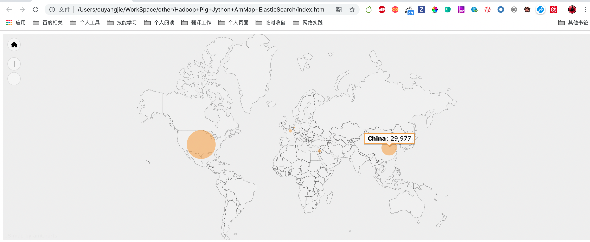

## 背景

实践参考：https://github.com/phodal/ideabook

我有一个 <del>2G左右</del> 很大的网站访问日志。我想看看访问网站的人都来自哪里，于是我想开始想办法来分析这日志，这是一个Web生成的界面，通过Elastic.js向搜索引擎查询数据，将再这些数据渲染到地图上。



Hadoop + Pig + Jython + AmMap + ElasticSearch

使用的技术栈有上面这些，他们的简介如下：

- Hadoop是一个由Apache基金会所开发的分布式系统基础架构。用户可以在不了解分布式底层细节的情况下，开发分布式程序。充分利用集群的威力进行高速运算和存储。
- Pig 是一个基于Hadoop的大规模数据分析平台，它提供的SQL-LIKE语言叫Pig Latin，该语言的编译器会把类SQL的数据分析请求转换为一系列经过优化处理的MapReduce运算。
- Jython是一种完整的语言，而不是一个Java翻译器或仅仅是一个Python编译器，它是一个Python语言在Java中的完全实现。Jython也有很多从CPython中继承的模块库。
- AmMap是用于创建交互式Flash地图的工具。您可以使用此工具来显示您的办公室地点，您的行程路线，创建您的经销商地图等。
- ElasticSearch是一个基于Lucene 构建的开源，分布式，RESTful 搜索引擎。 设计用于云计算中，能够达到搜索实时、稳定、可靠和快速，并且安装使用方便。

## 步骤

总的步骤并不是很复杂，可以分为：

- 搭建基础设施
- 解析access.log
- 转换IP为GEO信息
- 展示数据到地图上

### Step 1: 搭建基础设施

在这一些系列的实战中，比较麻烦的就是安装这些工具，我们需要安装上面提到的一系列工具。对于不同的系统来说，都有相似的安装工具：

- Windows上可以使用Chocolatey
- Ubuntu / Mint上可以使用aptitude
- CentOS / OpenSUSE上可以使用yum安装
- Mac OS上可以使用brew安装


如下是 Mac OS 下安装Hadoop、Pig、Elasticsearch、Jython 的方式

```bash
brew install hadoop
brew install pig
brew install elasticsearch
brew install jython
```
对于其他操作系统也可以使用相似的方法来安装。

Hadoop 安装完还要配置本地单机模式，ssh免登陆访问等，请自行百度

针对这些工具，可以配置一些启动关闭快捷命令：

```bash
alias es-start='brew services start elasticsearch'
alias es-stop='brew services stop elasticsearch'
alias kibana-start='brew services start kibana'
alias kibana-stop='brew services stop kibana'
alias hadoop-start-all='sh /usr/local/Cellar/hadoop/3.1.2/sbin/start-all.sh'
alias hadoop-stop-all='sh /usr/local/Cellar/hadoop/3.1.2/sbin/stop-all.sh'
```

接着我们还需要安装一个Hadoop的插件，用于连接 Hadoop 和 ElasticSearch。

下载地址：[https://github.com/elastic/elasticsearch-hadoop](https://github.com/elastic/elasticsearch-hadoop)

复制其中的 elasticsearch-hadoop-pig-*.jar 到你的pig库的目录，如我的是：/usr/local/Cellar/pig/0.17.0，这里我的文件名是：elasticsearch-hadoop-pig-7.3.0.jar。

下面我们就可以尝试去解析我们的日志了。

### *Step 2:* 解析access.log

在开始解析之前，先让我们来看看几条Nginx的日志：

```
10.95.30.42 - - [17/Jul/2019:00:00:29 +0800] "GET /v-dist/static/css/app.96cc1435284192fe5e4b4a4164f2660b.min.css HTTP/1.1" 200 217190
10.95.30.42 - - [17/Jul/2019:00:00:29 +0800] "GET /v-dist/static/js/vendor.1336ea68444e0be86ffd.min.js HTTP/1.1" 200 782353
```

而上面的日志实际上是有对应的格式的，这个格式写在我们的Nginx配置文件中。如下是上面的日志的格式：

```
log_format  access $remote_addr - $remote_user [$time_local] "$request" $status $body_bytes_sent;
```

在最前面的是访问者的IP地址，然后是访问者的当地时间、请求的类型、状态码、访问的URL、用户的User Agent等等。随后，我们就可以针对上面的格式编写相应的程序，这些代码如下所示：

```sql
-- register file:/usr/local/Cellar/pig/0.17.0/libexec/lib/piggybank.jar;
-- register file:/usr/local/Cellar/pig/0.17.0/libexec/lib/elasticsearch-hadoop-pig-7.3.0.jar;
register 'file:/usr/local/Cellar/pig/0.17.0/libexec/lib/*.jar';

RAW_LOGS = LOAD 'access/localhost_access_log.2019-07-17-02.txt' USING TextLoader as (line:chararray);
-- Dump RAW_LOGS;
LOGS_BASE = FOREACH RAW_LOGS GENERATE
    FLATTEN(
      REGEX_EXTRACT_ALL(line, '(\\S+) - - \\[([^\\[]+)\\]\\s+"([^"]+)"\\s+(\\d+)\\s+(\\d+|-)\\s*')
    )
    AS (
        ip: chararray,
        timestamp: chararray,
        url: chararray,
        status: chararray,
        bytes: chararray
    );
-- STORE LOGS_BASE INTO 'nginx/log_base' USING org.elasticsearch.hadoop.pig.EsStorage('es.http.timeout = 5m', 'es.index.auto.create = true');
-- STORE LOGS_BASE INTO 'data/demo-LOGS_BASE' USING PigStorage (',');
-- STORE LOGS_BASE INTO 'data/demo-LOGS_BASE';

-- Dump LOGS_BASE;
-- A = FOREACH LOGS_BASE GENERATE ToDate(timestamp, 'dd/MMM/yyyy:HH:mm:ss Z', 'Asia/Singapore') as date, ip, url,(int)status,(bytes == '-' ? 0 : (int)bytes) as bytes;
-- JDK1.8默认时区无法转化这种格式的 （17/Jul/2019:00:00:29 +0800） ，试了上百个时区，不知道具体是哪个时区，http://joda-time.sourceforge.net/timezones.html
A = FOREACH LOGS_BASE GENERATE ToDate(timestamp, 'dd/MMM/yyyy:HH:mm:ss Z', 'Etc/GMT+8') as date, ip, url,(int)status,(bytes == '-' ? 0 : (int)bytes) as bytes;
-- Dump A;
-- B = GROUP A BY (timestamp);
-- C = FOREACH B GENERATE FLATTEN(group) as (timestamp), COUNT(A) as count;
-- D = ORDER C BY timestamp,count desc;
-- STORE A INTO 'nginx/log' USING org.elasticsearch.hadoop.pig.EsStorage();
STORE A INTO 'data/demo-A' USING PigStorage (',');

-- 运行以下命令
-- pig -x local demo.pig > output/demo/log-`date "+%Y%m%d%H%M%S"`.log 2>&1
```

Pig 的学习请参考：https://www.w3cschool.cn/apache_pig/?

### *Step 3:* 转换IP为GEO信息

<del>在简单地完成了一个Demo之后，我们就可以将IP转换为GEO信息了，这里我们需要用到一个名为pygeoip的库。GeoIP是一个根据IP地址查询位置的API的集成。它支持对国家、地区、城市、纬度和经度的查询。实际上，就是在一个数据库中有对应的国家和地区的IP段，根据这个IP段，我们就可以获取对应的地理位置。</del>

因为 geoip 升级了，下不了离线数据库，替换成 geoip2

由于使用Java来实现这个功能比较麻烦，这里我们就使用Jython来实现。大部分的过程和上面都是一样的，除了注册了一个自定义的库，并在这个库里使用了解析GEO的方法，代码如下所示：

```sql
-- demo2.pig
register file:/usr/local/Cellar/pig/0.17.0/libexec/lib/piggybank.jar;
register file:/usr/local/Cellar/pig/0.17.0/libexec/lib/elasticsearch-hadoop-pig-7.3.0.jar;
register utils2.py using jython as utils;

RAW_LOGS = LOAD 'access/localhost_access_log.2019-07-17-02.txt' USING TextLoader as (line:chararray);

LOGS_BASE = FOREACH RAW_LOGS GENERATE
    FLATTEN(
      REGEX_EXTRACT_ALL(line, '(\\S+) - - \\[([^\\[]+)\\]\\s+"([^"]+)"\\s+(\\d+)\\s+(\\d+|-)\\s*')
    )
    AS (
        ip: chararray,
        timestamp: chararray,
        url: chararray,
        status: chararray,
        bytes: chararray
    );

A = FOREACH LOGS_BASE GENERATE timestamp as date, utils.get_country(ip) as country,
    utils.get_city(ip) as city, utils.get_geo(ip) as location,ip,
    url, (int)status,(bytes == '-' ? 0 : (int)bytes) as bytes;

STORE A INTO 'nginx_access/log' USING org.elasticsearch.hadoop.pig.EsStorage();

B = GROUP A BY (country,city,location);
C = FOREACH B GENERATE FLATTEN(group), COUNT(A.location) as counts;

STORE C INTO 'data/demo2-C1' USING PigStorage(',');

-- pig -x local demo2.pig > output/demo2/log-`date +%Y%m%d%H%M%S`.log 2>&1

-- demo4.pig
register file:/usr/local/Cellar/pig/0.17.0/libexec/lib/piggybank.jar;
register file:/usr/local/Cellar/pig/0.17.0/libexec/lib/elasticsearch-hadoop-pig-7.3.0.jar;

A = LOAD 'data/demo2-C1' USING PigStorage(',') as (country:chararray,city:chararray,longitude:float,latitude:float,counts:int);
B = FILTER A BY counts > 0;
STORE B INTO 'nginx_access_city/log_city_sum' USING org.elasticsearch.hadoop.pig.EsStorage();

-- pig -x local demo4.pig > output/demo4/log-`date +%Y%m%d%H%M%S`.log 2>&1
```

在第三行里，我们注册了 <del>utils.py</del> utils2.py 并将其中的函数作为 utils。接着在倒数第二行里，我们执行了四个 utils 函数。即:

- get_country从IP中解析出国家
- get_city从IP中解析出城市
- get_geo从IP中解析出经纬度信息


其对应的 Python 代码如下所示:
```python
# -*- coding:utf-8 -*-
import sys
sys.path.append('/Users/ouyangjie/Library/Python/3.7/lib/python/site-packages')
sys.path.append('/Library/Frameworks/Python.framework/Versions/3.7/lib/python3.7/site-packages')
import geoip2.database
reader = geoip2.database.Reader('GeoLite2-City_20190813/GeoLite2-City.mmdb')

@outputSchema('city:chararray')
def get_city(ip):
    try:
        response = reader.city(ip)
        return response.city.name
    except:
        pass


@outputSchema('country:chararray')
def get_country(ip):
    try:
        response = reader.city(ip)
        return response.country.name
    except:
        pass

@outputSchema('location:chararray')
def get_geo(ip):
    try:
        response = reader.city(ip)
        location = response.location
        geo = str(location.longitude) + "," + str(location.latitude)
        return geo
    except:
        pass
```

代码相应的简单，和一般的 Python 代码也没有啥区别。这里一些用户自定义函数，在函数的最前面有一个 outputSchema，用于 jython 返回输出的结果。

### *Step 4:* 展示数据到地图上

现在，我们终于可以将数据转化到可视化界面了。开始之前，我们需要几个库

- jquery 地球人都知道
- elasticsearch.jquery 即用于搜索功能
- ammap 用于制作交互地图

```bash
# 我们用 bower 去获取我们需要的 js 脚本
npm install -g bower
mkdir js
cd js
bower init
# 一路回车
bower install jquery
bower install elasticsearch
bower install ammap
```

添加这些库到html文件里:

```html
<!DOCTYPE html>
<html lang="en">
<head>
    <meta charset="UTF-8">
    <meta name="viewport" content="width=device-width, initial-scale=1.0">
    <meta http-equiv="X-UA-Compatible" content="ie=edge">
    <title>Access-Map</title>
    <script src="js/bower_components/jquery/dist/jquery.js"></script>
    <script src="js/bower_components/elasticsearch/elasticsearch.jquery.js"></script>
    <script src="js/bower_components/ammap/dist/ammap/ammap.js" type="text/javascript"></script>
    <script src="js/bower_components/ammap/dist/ammap/maps/js/worldLow.js" type="text/javascript"></script>
    <script src="js/bower_components/ammap/dist/ammap/themes/black.js" type="text/javascript"></script>
</head>
<body>
    <div id="mapdiv" style="width: 100%; background-color:#eeeeee; height: 500px;"></div>
</body>
</html>
```

生成过程大致如下所示：

- 获取不同国家的全名
- <del>查找 ElasticSearch 搜索引擎中的数据，并计算访问量</del> (ES SDL 参考：http://doc.codingdict.com/elasticsearch/1/)
- 直接从 ES 取 pig 处理好的访问量数据（见 Step 3 的 demo4.pig）
- 再将数据渲染到地图上

对应的 js 渲染代码如下所示：
```js
var client = new $.es.Client({
    hosts: 'http://localhost:9200'
});

// 创建 ElasticSearch 搜索条件
var query = {
    index: 'nginx_access_city',
    type: 'log_city_sum',
    size: 200,
    body: {}
};

// 初始化
$(document).ready(function () {
    generate_info();
});

// 根据数据中的国家名，来计算不同国家的访问量大小。
var generate_info = function(){
    debugger;
    var mapDatas = [];
    client.search(query).then(function (results) {
        $.each(results.hits.hits, function(index, item){
            source = item["_source"];
            var mapData;
            if (null != source) {
                mapData = {
                    code: source.city,
                    name: source.country,
                    longitude:source.longitude,
                    latitude:source.latitude,
                    value: source.counts,
                    color: "#eea638"
                };
            }
            if(mapData !== undefined){
                mapDatas.push(mapData);
            }
        });
        create_map(mapDatas);
    });
};

var create_map = function(mapData) {
    var map;
    var minBulletSize = 3;
    var maxBulletSize = 70;
    var min = Infinity;
    var max = -Infinity;

    AmCharts.theme = AmCharts.themes.black;

    for (var i = 0; i < mapData.length; i++) {
        var value = mapData[i].value;
        if (value < min) {
            min = value;
        }
        if (value > max) {
            max = value;
        }
    }

    map = new AmCharts.AmMap();
    map.pathToImages = "js/bower_components/ammap/dist/ammap/images/";

    map.areasSettings = {
        unlistedAreasColor: "#FFFFFF",
        unlistedAreasAlpha: 0.1
    };

    map.imagesSettings = {
        balloonText: "<span style='font-size:14px;'><b>[[title]]</b>: [[value]]</span>",
        alpha: 0.6
    };

    var dataProvider = {
        mapVar: AmCharts.maps.worldLow,
        images: []
    };

    var maxSquare = maxBulletSize * maxBulletSize * 2 * Math.PI;
    var minSquare = minBulletSize * minBulletSize * 2 * Math.PI;

    for (var i = 0; i < mapData.length; i++) {
        var dataItem = mapData[i];
        var value = dataItem.value;
        // calculate size of a bubble
        var square = (value - min) / (max - min) * (maxSquare - minSquare) + minSquare;
        if (square < minSquare) {
            square = minSquare;
        }
        var size = Math.sqrt(square / (Math.PI * 2));
        var id = dataItem.code;

        dataProvider.images.push({
            type: "circle",
            width: size,
            height: size,
            color: dataItem.color,
            longitude: dataItem.longitude,
            latitude: dataItem.latitude,
            title: dataItem.name,
            value: value
        });
    }

    map.dataProvider = dataProvider;

    map.write("mapdiv");
};  
```

PS：如果执行时候渲染 HTML 页面查询 ES 有跨域访问问题，需要先解决 ES 跨域配置
